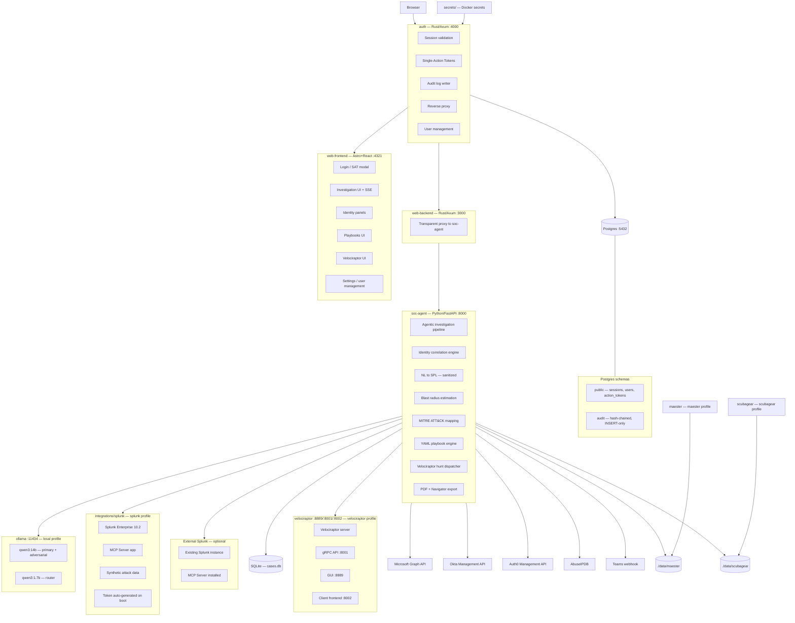
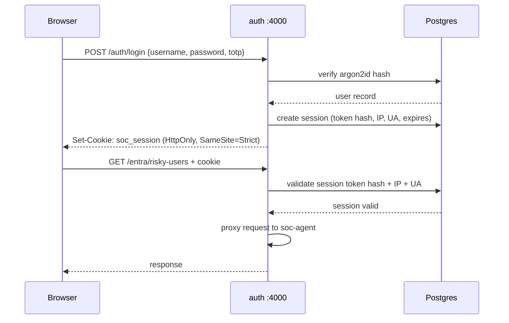
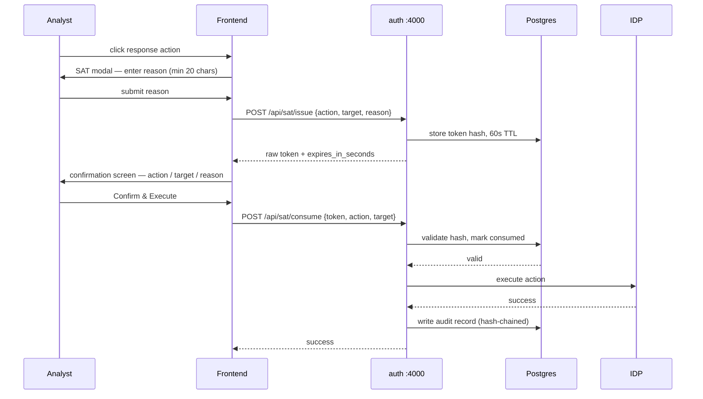
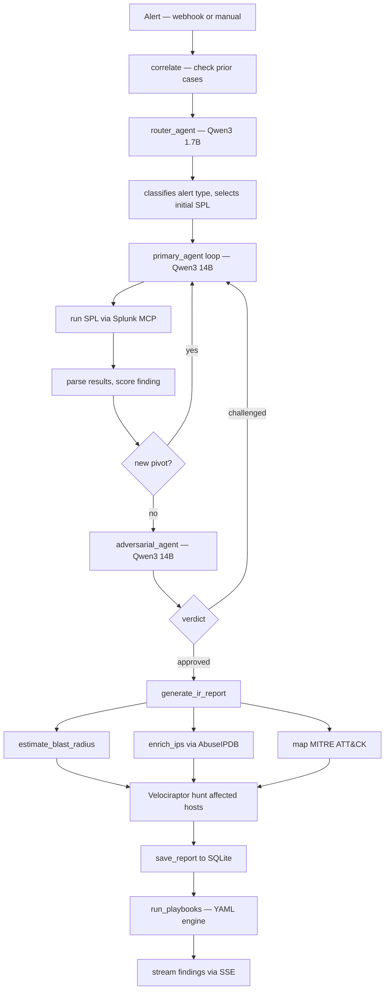
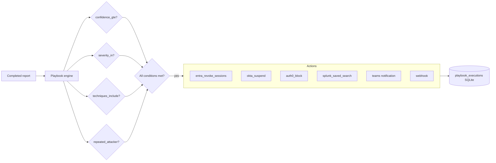
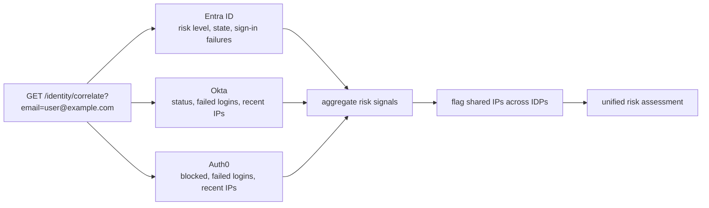
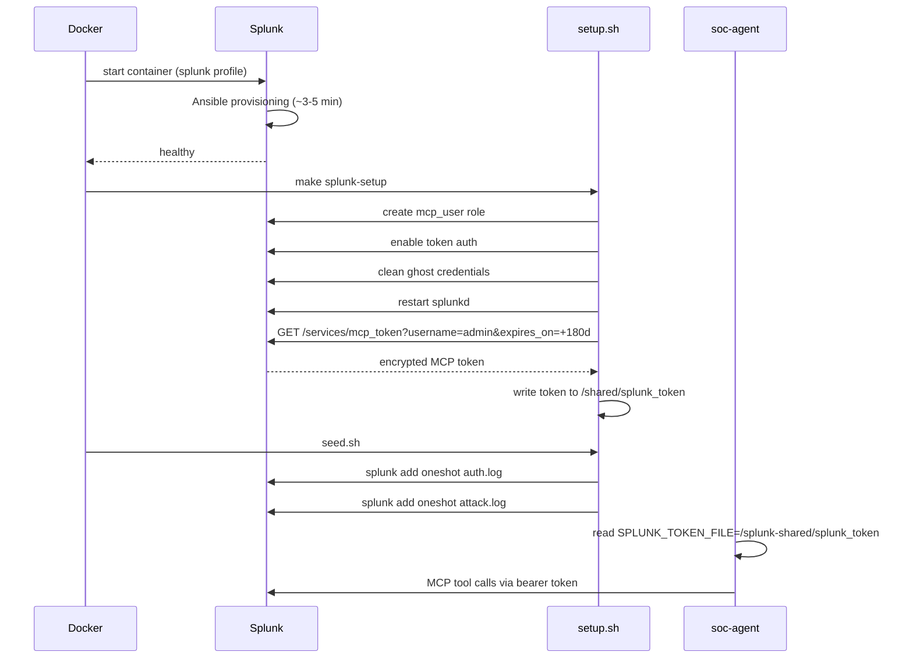

# Architecture — TriagaSOAR

---

## System topology

---

## Auth sequence

---

## Single-Action Token flow

---

## Investigation pipeline

---

## Playbook engine

---

## Identity correlation

---

## Containerized Splunk boot sequence

---

## Container details

### auth (port 4000)

- **Stack:** Rust, Axum, sqlx, argon2, totp-rs, sha2
- **Secrets:** `ADMIN_PASSWORD` and `SESSION_SECRET` loaded from Docker secrets (`/run/secrets/`), never in environment variables

**Session properties**
- 32-byte CSPRNG tokens, Argon2id-hashed at rest
- HttpOnly, SameSite=Strict cookies, 30-minute absolute expiry
- IP address + user agent binding
- One concurrent session per user

**User management endpoints**
- `GET /users` — list all users (admin only)
- `POST /users` — create user (admin only, defaults to `analyst` role)
- `DELETE /users/{id}` — deactivate user (admin only, cannot deactivate self)
- `POST /users/change-password` — any authenticated user

**Audit log**
- Separate `audit` Postgres schema, INSERT-only role
- SHA-256 hash-chained entries
- Chain integrity verifiable via `GET /audit/verify`

---

### soc-agent (port 8000)

**Key modules**

| File | Responsibility |
|------|---------------|
| `main.py` | FastAPI app, all routes |
| `agent.py` | Router + primary + adversarial agents |
| `splunk_mcp.py` | MCP client — reads token from file or env var |
| `velociraptor.py` | Hunt dispatcher via docker exec |
| `playbooks.py` | YAML playbook engine |
| `blast_radius.py` | Affected IPs, users, hosts |
| `report.py` | Structured IR report assembly |
| `database.py` | SQLite: cases, entities, verdicts, playbook executions |
| `patterns.py` | 21 attack patterns + 9 EDR evasion hunts |
| `threat_intel.py` | AbuseIPDB lookups with cache |
| `entra.py` | Microsoft Graph API client |
| `okta.py` | Okta Management API client |
| `auth0.py` | Auth0 Management API client |

**NL to SPL security**
- User input isolated in separate LLM message
- Injection pattern blocklist on input
- SPL validator on output: index check, dangerous command ban, 1000-char cap

---

### integrations/splunk

- Base: `splunk/splunk:10.2` official image
- Web UI disabled (`startwebserver = false`) to avoid port 8000 conflict
- MCP Server pre-baked at build time
- Token auto-generated on first `make splunk-setup`
- Ghost credential cleanup baked into `setup.sh` (upstream bug in `crypto.py` — `allow_overwrite=True` not used on first key generation)
- Token written to shared Docker volume, read by soc-agent via `SPLUNK_TOKEN_FILE`

---

### velociraptor (ports 8889/8001/8002)

- Image: `xboarder56/velociraptor:latest`
- API config generated via `make velociraptor-setup` (`config api_client --name localhost --role administrator`)
- soc-agent calls Velociraptor via `docker exec` (bypasses gRPC TLS hostname verification issue)
- API config written to shared volume, mounted read-only in soc-agent
- Hunt dispatch and artifact collection triggered automatically after each investigation

---

## Ports

| Service | Port | Notes |
|---------|------|-------|
| auth | 4000 | Single entry point for all traffic |
| web-frontend | 4321 | Via auth proxy |
| web-backend | 3000 | Via auth proxy |
| soc-agent | 8000 | Via auth proxy |
| ollama | 11434 | Via auth proxy |
| postgres | 5432 | Internal only |
| Splunk management | 8089 | Splunk profile only |
| Velociraptor GUI | 8889 | Velociraptor profile only |
| Velociraptor gRPC | 8001 | Velociraptor profile only |
| Velociraptor clients | 8002 | Velociraptor profile only |

---

## Profiles

| Profile | Services |
|---------|---------|
| `local` | ollama, soc-agent-local, web-backend, web-frontend, auth, postgres |
| `cloud` | soc-agent-cloud, web-backend, web-frontend, auth, postgres |
| `splunk` | Splunk Enterprise + MCP Server (additive) |
| `velociraptor` | Velociraptor DFIR platform (additive) |
| `maester` | Maester M365 checks (additive) |
| `scubagear` | ScubaGear CISA baseline (additive) |

---

## Storage

| Store | Location | Contents |
|-------|----------|---------|
| SQLite | `./data/cases.db` | Cases, entities, verdicts, playbook executions, threat intel cache |
| Postgres | Docker volume `postgres_data` | Sessions, users, action tokens, audit log |
| Ollama models | Docker volume `ollama_data` | Model weights |
| Splunk data | Docker volume `splunk_data` | Splunk indexes and config |
| Shared token | Docker volume `splunk_shared` | MCP token file |
| Velociraptor data | Docker volume `velociraptor_data` | Server config, client enrollments |
| Velociraptor API | Docker volume `velociraptor_shared` | API config for soc-agent |
| Secrets | `./secrets/` | admin_password.txt, session_secret.txt (gitignored) |